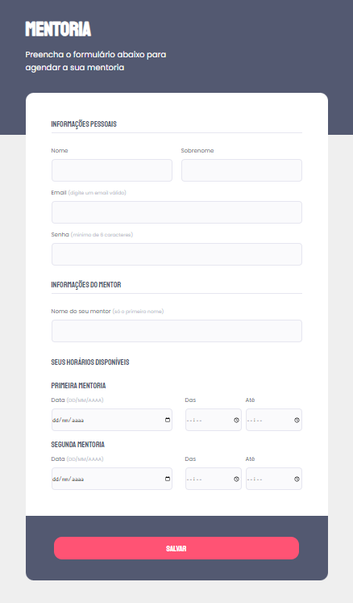

<h1 align="center"> # Explorer - S03 - Mentoria </h1>

Exercício desafio do stage 03-Formulários do curso Explorer da rocketseat

## 🚀 Tecnologias
Esse projeto foi desenvolvido com as seguintes tecnologias:
- HTML e CSS
- Git e Github
- Figma

## Conceitos

Foram utilizados os seguintes conceitos e resources:

- Pseudoclass before
- display flex
- input
- nth-child

## Preview

  

